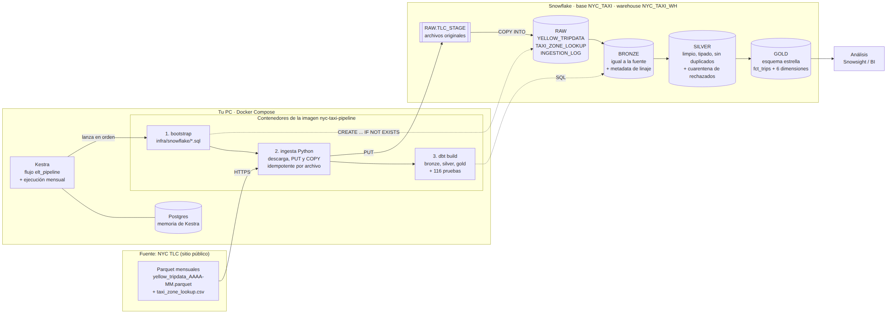

# Laboratorio Integrador 1

Tubería ELT reproducible que ingiere, almacena, transforma y modela los viajes de NYC Yellow Taxi de enero 2025 a agosto 2026 con **Docker + Kestra + Python +
Snowflake + dbt**, organizada en capas **Bronze, Silver, Gold**.

David Bucheli - Ciencia de Datos - Semana 07



## Contenido del repositorio

| Carpeta / archivo | Qué contiene | Entregable |
|---|---|---|
| `docker-compose.yml`, `Dockerfile`, `requirements.txt` | Infraestructura local: Kestra + Postgres + imagen de la tubería | Código de infraestructura |
| `infra/snowflake/` | SQL que crea warehouse, base, esquemas, stage y tablas RAW | Código de infraestructura |
| `ingestion/` | Descarga idempotente de la TLC y carga en Snowflake (`COPY INTO`) | Código de ingesta |
| `kestra/flows/` | Flujo `elt_pipeline` que orquesta todo (+ ejecución mensual) | Orquestación |
| `dbt/nyc_taxi/` | Modelos Bronze, Silver y Gold, seeds, macros y 116 pruebas | Proyecto dbt |
| `docs/arquitectura.md` | Diagrama y explicación de la arquitectura | Diagrama de arquitectura |
| `docs/esquema_estrella.md` | Diagrama del modelo, grano, llaves, métricas | Diagrama del esquema estrella |
| `docs/decisiones_calidad_datos.md` | Reglas de limpieza y su justificación | Justificación de Silver |
| `scripts/` | Generar el par de llaves y probar la conexión | Utilidades |
| `.env.example` | Plantilla de configuración (sin secretos) | |

## Capas en Snowflake (base `NYC_TAXI`)

| Esquema | Tablas | Descripción |
|---|---|---|
| `RAW` | `YELLOW_TRIPDATA`, `TAXI_ZONE_LOOKUP`, `INGESTION_LOG`, stage `TLC_STAGE` | Aterrizaje: archivos originales y datos tal cual llegan. |
| `BRONZE` | `BRZ_YELLOW_TRIPDATA`, `BRZ_TAXI_ZONE_LOOKUP` | Igual a la fuente + metadata: `_source_file`, `_source_period`, `_file_row_number`, `_loaded_at`, `_record_id`. |
| `SILVER` | `SLV_YELLOW_TRIPS`, `SLV_YELLOW_TRIPS_STANDARDIZED`, `SLV_YELLOW_TRIPS_REJECTED`, `SLV_TAXI_ZONES`, `SLV_DATA_QUALITY_SUMMARY`, `REF_*` | Tipos, nulos, duplicados, inválidos y formatos tratados. Ver [decisiones](docs/decisiones_calidad_datos.md). |
| `GOLD` | `FCT_TRIPS`, `DIM_DATE`, `DIM_TIME`, `DIM_ZONE`, `DIM_VENDOR`, `DIM_RATE_CODE`, `DIM_PAYMENT_TYPE` | Esquema estrella. **Grano:** un viaje válido. Ver [esquema estrella](docs/esquema_estrella.md). |

## Requisitos

- [Docker Desktop](https://www.docker.com/products/docker-desktop/) (en Windows, con WSL 2).
- [Git](https://git-scm.com/).
- Una cuenta de Snowflake con un rol que pueda crear warehouse y base de datos, o un warehouse y una base ya creados.

No hace falta instalar Python ni dbt, todo corre dentro de Docker.

## Puesta en marcha

Todos los comandos se ejecutan desde esta carpeta (`laboratorios/semana-07`) en **PowerShell**.

**1. Configuración.** Copia la plantilla y llena `SNOWFLAKE_ACCOUNT` (formato `ORGANIZACION-CUENTA`),
`SNOWFLAKE_USER` y `SNOWFLAKE_ROLE`:

```powershell
Copy-Item .env.example .env
```

**2. Par de llaves** Este
comando crea las llaves en `secrets/` y escribe la llave privada en `.env`:

```powershell
docker run --rm -v "${PWD}:/work" -w /work python:3.12-slim sh -c "pip install -q --root-user-action=ignore cryptography && python scripts/generate_keypair.py"
```

Después ejecuta en Snowflake el contenido de `secrets/alter_user.sql`, que registra la llave pública.

**3. Levantar la infraestructura y probar la conexión:**

```powershell
docker compose up -d --build
docker compose run --rm pipeline python scripts/check_connection.py
```

Kestra queda en **http://localhost:8080** (usuario y contraseña: los de `KESTRA_ADMIN_*` en `.env`).

**4. Ejecutar la tubería:** en Kestra, abre **Flows → nyc_taxi → elt_pipeline → Execute**.
Las 6 tareas corren en orden:

```
snowflake_infra → ingest_zones → ingest_trips → dbt_bronze → dbt_silver → dbt_gold
```

<details>
<summary>Alternativa sin Kestra (paso a paso desde la terminal)</summary>

```powershell
docker compose run --rm pipeline python -m ingestion bootstrap
docker compose run --rm pipeline python -m ingestion zones
docker compose run --rm pipeline python -m ingestion trips
docker compose run --rm pipeline dbt build --select path:models/bronze --indirect-selection buildable
docker compose run --rm pipeline dbt build --select path:seeds path:models/silver --indirect-selection buildable
docker compose run --rm pipeline dbt build --select path:models/gold --indirect-selection buildable
```
</details>

## Ejecutar desde cero

1. En Snowflake, ejecuta `infra/snowflake/99_teardown.sql` (`DROP DATABASE IF EXISTS NYC_TAXI;`).
2. En Kestra, ejecuta `elt_pipeline` con los valores por defecto.

La tubería vuelve a crear la base, los esquemas y las tablas, descarga los 20 meses y construye
Bronze, Silver y Gold. 

Opciones del flujo:
- `force_reload`: vuelve a descargar los archivos aunque no hayan cambiado.
- `full_refresh`: reconstruye desde cero las tablas incrementales de dbt.

## Idempotencia

- **Ingesta:** cada archivo se identifica por su huella (ETag) en `RAW.INGESTION_LOG`. Si no cambió,
  se salta. Si cambió, se reemplazan **solo sus filas** dentro de una transacción, y se verifica que
  Snowflake cargó exactamente las filas del archivo.
- **dbt:** los modelos grandes son `incremental` con `delete+insert` por archivo de origen: procesan
  únicamente archivos nuevos o recargados y los reemplazan completos.
- **Evidencia:** ejecutar el flujo dos veces deja los mismos conteos en RAW, BRONZE, SILVER y GOLD.

## Pruebas de dbt (116)

| Tipo | Dónde | Ejemplos |
|---|---|---|
| `not_null` | Todas las capas | PK, FK, fechas, archivo de origen |
| `unique` | PK de hechos y dimensiones, llaves naturales | `trip_key`, `zone_key`, `date_key`, `_record_id` |
| `relationships` | Silver → catálogos; Gold: 9 FK → dimensiones | `fct_trips.pickup_zone_key → dim_zone.zone_key` |
| `accepted_values` / `accepted_range` / `expression_is_true` | Silver y Gold | pasajeros 1-6, distancia 0-200, fin > inicio |
| Reconciliación (SQL propio en `tests/`) | Entre capas | RAW = bitácora, Bronze = RAW, Gold = Silver, sin duplicados |

## Disponibilidad de los datos

La TLC publica cada mes con unos 2 meses de retraso. La tubería registra la información faltante
como `NOT_AVAILABLE` en `RAW.INGESTION_LOG` y la carga automáticamente cuando se publique, sin duplicar los meses ya cargados.

## Solución de problemas

| Problema | Solución |
|---|---|
| `JWT token is invalid` | La llave pública no está registrada: ejecuta `secrets/alter_user.sql` en Snowflake. |
| Kestra no muestra el flujo | `docker compose restart kestra`, o pégalo en **Flows → Create**. |
| `No such image: nyc-taxi-pipeline` | `docker compose up -d --build` |
| Cambié el `.env` | `docker compose up -d` (recrea Kestra con las variables nuevas). |
| Cambié código | `docker compose up -d --build` |