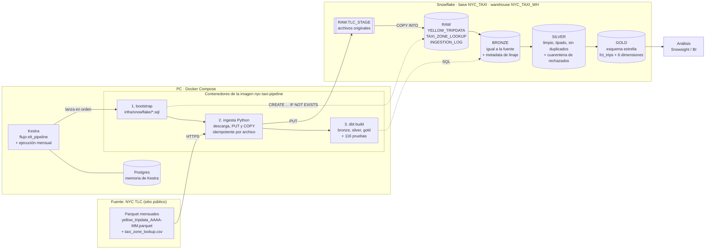

# Arquitectura de la solución

## Componentes

| Componente | Tecnología | Responsabilidad |
|---|---|---|
| Infraestructura local | Docker Compose | Levanta Kestra y Postgres, y construye la imagen `nyc-taxi-pipeline` (Python 3.12 + dbt + código). |
| Infraestructura en la nube | SQL (`infra/snowflake/`) | Crea warehouse, base, esquemas por capa, stage, formatos y tablas RAW (`IF NOT EXISTS`). |
| Orquestación | Kestra 1.3 | Ejecuta las 6 tareas en orden, reintenta la ingesta y se programa el día 5 de cada mes. |
| Ingesta (E + L) | Python (`ingestion/`) | Descarga los archivos de la TLC, guarda el original en un stage y lo carga con `COPY INTO`. |
| Transformación (T) | dbt 1.12 (`dbt/nyc_taxi/`) | Modelos Bronze → Silver → Gold y 116 pruebas. |
| Almacenamiento y cómputo | Snowflake | Capas RAW, BRONZE, SILVER y GOLD en la base `NYC_TAXI`. |

## Por qué ELT

Primero se cargan los datos originales sin cambios (RAW y Bronze) y después se transforman
dentro de Snowflake con dbt. Los datos crudos se conservan siempre (cualquier regla de limpieza se
puede cambiar y recalcular sin volver a descargar nada).

## Idempotencia

1. **Ingesta:** `RAW.INGESTION_LOG` guarda la huella (ETag) y las filas de cada archivo. Un archivo
   sin cambios se salta. Si cambió, en una transacción se borran sus filas y se vuelve a cargar,
   verificando que Snowflake cargó exactamente las filas del archivo.
2. **dbt:** los modelos grandes son incrementales con `delete+insert` por `_source_file`: solo se
   procesan los archivos nuevos o recargados, y se reemplazan completos.
3. **Pruebas de reconciliación:** RAW = bitácora, Bronze = RAW, Silver evalúa todo Bronze y
   Gold = Silver (viajes y montos por archivo).