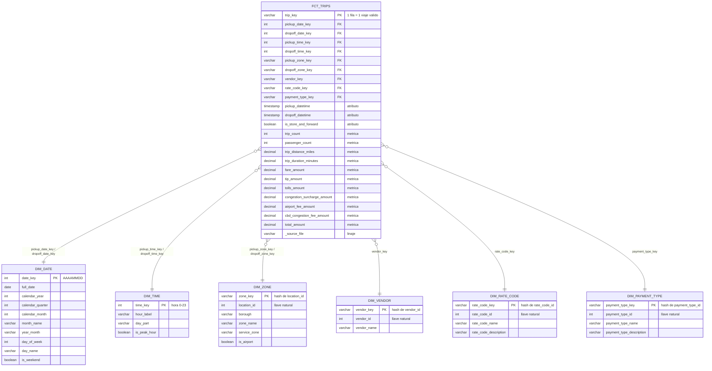

# Esquema estrella (capa GOLD)

## Grano

**Una fila de `fct_trips` = un viaje válido de Yellow Taxi**, es decir, un encendido y apagado del
taxímetro que pasó todas las reglas de calidad de Silver.

## Llaves

| Tabla | Llave primaria | Tipo de llave |
|---|---|---|
| `fct_trips` | `trip_key` | Hash de archivo de origen + número de fila: estable entre ejecuciones. |
| `dim_date` | `date_key` | Entero `AAAAMMDD` (estándar para fechas). |
| `dim_time` | `time_key` | Hora del día `0-23`. |
| `dim_zone` | `zone_key` | Sustituta: hash de `location_id`. |
| `dim_vendor` | `vendor_key` | Sustituta: hash de `vendor_id`. |
| `dim_rate_code` | `rate_code_key` | Sustituta: hash de `rate_code_id`. |
| `dim_payment_type` | `payment_type_key` | Sustituta: hash de `payment_type_id`. |

**Llaves foráneas:** `fct_trips` tiene 9. `dim_date`, `dim_time` y `dim_zone` son *role-playing
dimensions*: se usan dos veces, una para la recogida y otra para la llegada o el destino. Cada FK
tiene pruebas `not_null` y `relationships` en dbt.

## Métricas y atributos

- **Métricas aditivas:** `trip_count`, `trip_distance_miles`, `trip_duration_minutes` y todos los
  montos (`fare`, `extra`, `mta_tax`, `tip`, `tolls`, `improvement_surcharge`, `congestion_surcharge`,
  `airport_fee`, `cbd_congestion_fee`, `total`). `passenger_count` es aditiva, pero admite nulos.
- **Atributos del hecho (dimensiones degeneradas):** `pickup_datetime`, `dropoff_datetime` y
  `is_store_and_forward`.
- **Atributos de análisis en las dimensiones:** año, mes, día de la semana, fin de semana; franja
  horaria y hora pico; distrito, zona, zona de servicio y aeropuerto; proveedor; tarifa; forma de pago.

## Preguntas que responde

Viajes e ingresos por mes, día o franja horaria; rutas más frecuentes entre zonas; propina según la
forma de pago; efecto del cargo de congestión de Manhattan (desde enero de 2025); viajes a
aeropuertos. Hay consultas de ejemplo en `dbt/nyc_taxi/analyses/consultas_ejemplo.sql`.